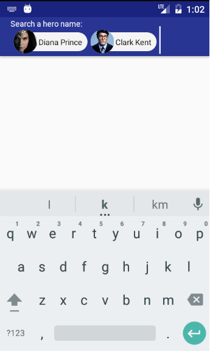
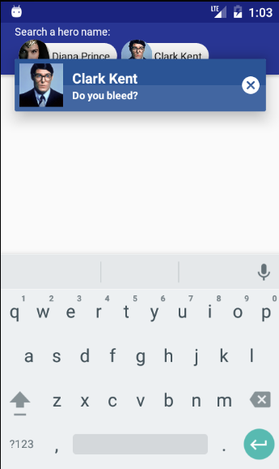

# Android Chip Interface
[  ](https://bintray.com/edsilfer/maven/chip-interface/_latestVersion) - **MIN API 16**

<a name="summary">
## Summary
1. [Introduction](#introduction) 
2. [How does it work?](#how-it-work) 
   * [Step 01](#step1) 
   * [Step 02](#step2) 
   * [Step 03](#step3) 
   * [Step 04](#step4) 
   * [Step 05](#step5) 
2. [License](#license) 

<a name="introduction">
## Introduction
>Chips represent complex entities in small blocks, such as a contact.
>
> Material Design Manifest - Chips _https://material.google.com/components/chips.html_

<p align="center">
  
  
  
  
  <br /><br />
  <i><b>Figure 01:</b> Android Chip Interface showcase</i>
</p>

<a name="how-it-work">
## How does it work?
Android Chip Interface was developed using [Kotlin language](https://kotlinlang.org/). Kotlin is free to use and owned by [Jet Brains](https://www.jetbrains.com/). It adds a lot of cool features, boosting your productiveness while keeping everythying **100% compatible with Java.** 

_For details about technical implementation of this library please refer to the source code._


<a name="step1">
### Step 01: import the module

Add the library module dependency to your project:
```groovy
compile 'br.com.edsilfer.android:chip-interface:1.0.10'
```

<a name="step2">
### Step 02: add ```ChipEditText``` to your layout file

```xml
  <br.com.edsilfer.android.chipinterface.presenter.ChipEditText
                    android:layout_width="match_parent"
                    android:layout_height="wrap_content"
                    android:textColor="@color/colorAccent"
                    app:template="@raw/template_default_android_chip" />
```

<a name="step3">
### Step 03: make your POJO extends `Chip` and override the abstract methods

In order to render the chip correctly, Android Chip Interface requires that the complex object that will have its representation converted into a chip to extend the `Chip` class and implement its abstract methods:

```kotlin
abstract class Chip() {
    abstract fun getHeader(): String

    abstract fun getSubheader(): String

    abstract fun getThumbnail(): String
}
``` 

<a name="step4">
### Step 04: use `ChipControl` interface to add and remove chips

`ChipEditTex` implements `ChipControl`, so you can retrieve it inside your code and call the methods:
- `setChipStyle (style : ChipPalette)`: before using the methods below you must call this method in order to specify which design Android Chip Interface will use to render. You may customize your own layout or use some preset provided in `Presets` class:

<p align="center">
  
  <br /><br />
  <i><b>Figure 02:</b> Android Chip layout explanation</i>
</p>

- `addChip(chip: Chip, replaceable : String)`: adds a chip inside `ChipEditTex`. `replaceable` is the typed text existent on `ChipEditTex` that will be replaced by the chip; 

- `removeChip(chip: Chip)`: removes the prev priviously inserted chip;

<a name="step5">
### Step 05: Customize Chip layout
For custom layout, place a XML file on res/raw folder and pass it on template attribute of ChipEditText:

```XML
<?xml version="1.0"?>

<chip id="default-theme">
    <state type="collapsed">
        <text type="label">
            <font>sans-serif</font>
            <size>12</size>
            <style>normal</style>
            <color>#a5a5a5</color>
        </text>
        <background type="collapsed">#f8f8fa</background>
    </state>

    <state type="expanded">
        <text
            id="header"
            type="label">
            <font>sans-serif</font>
            <size>14</size>
            <style>normal</style>
            <color>#ffffff</color>
        </text>

        <text
            id="subheader"
            type="label">
            <font>sans-serif</font>
            <size>12</size>
            <style>normal</style>
            <color>#ffffff</color>
        </text>

        <background type="top">#1A237E</background>
        <background type="bottom">#283593</background>
    </state>
</chip>
```

*Note 01: this XML will be validate agains a XSD. Please, stick to the file structure.*

*Note 02: In order to customize the input text style you can treat ChipEditText as a regular EditText.*

<a name="license">
## License
Copyright 2016 Edgar da Silva Fernandes

Licensed under the Apache License, Version 2.0 (the "License");
you may not use this file except in compliance with the License.
You may obtain a copy of the License at

    http://www.apache.org/licenses/LICENSE-2.0

Unless required by applicable law or agreed to in writing, software
distributed under the License is distributed on an "AS IS" BASIS,
WITHOUT WARRANTIES OR CONDITIONS OF ANY KIND, either express or implied.
See the License for the specific language governing permissions and
limitations under the License.
